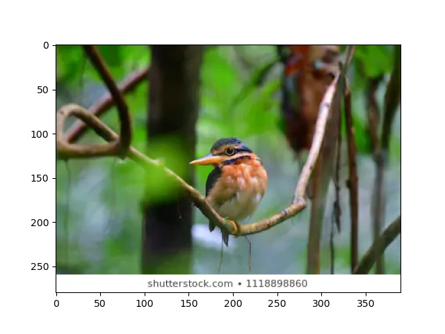
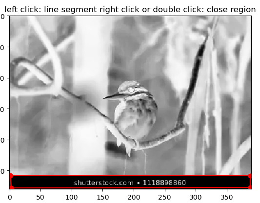
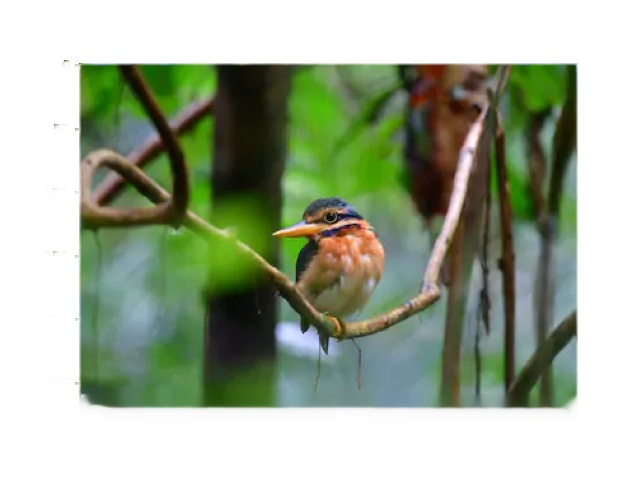

# Image_Inpainting_with_Fast-Marching-Method-&-Navier-Stokes (Python/OpenCV)
Image_Inpainting_in_Photographs_Python

# Introduction
This project uses inpainting functionalities in OpenCV to remove small noises, strokes, and watermarks.
The polygonal region of interest (ROIpoly) module is added to draw the mask more accessible in an image.  

## Original

## Inpaint / Remove watermarks
  

# Prerequisites
- Matplotlib = pip install matplotlib 
- Roipoly = pip install roipoly
- OpenCV = pip install opencv-python

# Test image impainting
## Draw Mask ROI
  - python draw_mask.py
  
## Run Impainting
  - python inpaint.py 

## Reference and Acknowledgments
The project code is reference from https://docs.opencv.org/master/df/d3d/tutorial_py_inpainting.html.
